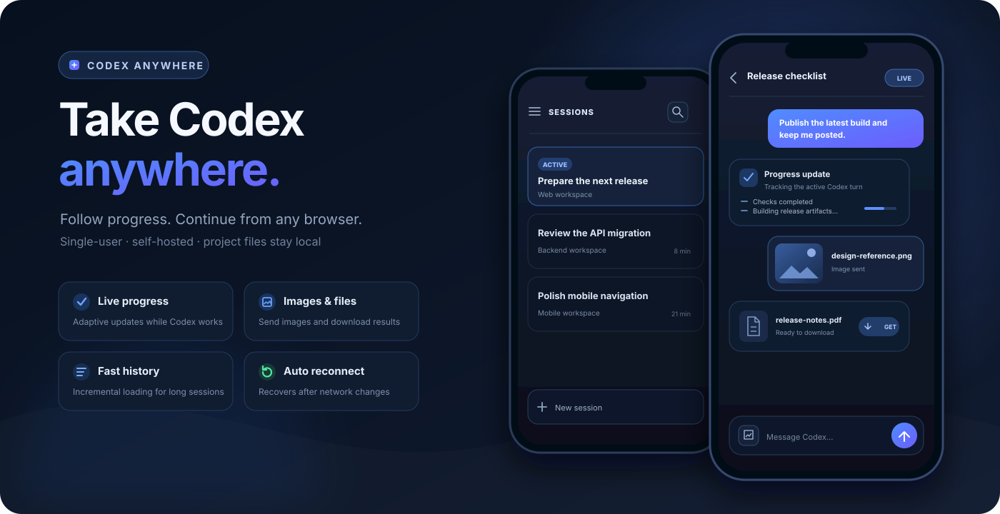

# Codex Anywhere

English | [简体中文](README.zh-CN.md)

[](https://github.com/gaotong132/codex-anywhere/actions/workflows/ci.yml)
[](https://github.com/gaotong132/codex-anywhere/actions/workflows/codeql.yml)
[](LICENSE)

<p align="center">
  
</p>

Codex Anywhere is a single-user, self-hosted bridge for following and continuing the Codex sessions
on your computer from a phone or another browser. Codex and project files stay on the connector
computer; a lightweight relay on your own ECS/VPS provides the remote entry point.

> [!IMPORTANT]
> This is an unofficial community project. It is not affiliated with or endorsed by OpenAI.

## Features and highlights

- **Continue existing sessions** — browse recent Codex sessions, open Markdown history, and send new
  text or image messages from a phone.
- **Follow work in progress** — see running state and automatically refresh useful assistant progress
  without exposing internal reasoning or tool-call noise.
- **Fast on long histories** — session lists and conversation history are loaded incrementally instead
  of downloading every session in full.
- **Mobile-oriented controls** — create a session in an existing project, search recent sessions, open
  attachments, and download assistant-linked local files after confirmation.
- **Resilient connection** — the browser and connector recover automatically from transient disconnects
  and network switches.
- **Self-hosted and private by design** — the local computer accepts no public inbound connection; the
  relay does not persist conversations, attachments, or downloaded files.
- **Chinese and English UI** — select `zh-CN` or `en` through runtime configuration.

Codex Anywhere is intentionally a personal bridge. It does not provide automatic session forks, a
general remote shell, or a multi-user gateway.

## Architecture

<p align="center">
  
</p>

```text
phone / browser ── WS or WSS ──> your ECS/VPS relay
                                      ▲
local connector ── outbound WS/WSS ───┘
       │
       └── Codex Desktop/CLI + local projects
```

Both the browser and the local connector initiate connections to the relay. The relay authenticates
them and forwards live frames in memory; Codex execution and file access remain local.

App-server-owned turns use the Codex app-server JSON-RPC protocol and can stream native deltas.
Existing desktop-owned sessions use Codex Desktop task tools for delivery and adaptive history-tail
polling over the same WebSocket. Codex Anywhere does not implement ACP.

## Deployment

### What you need

| Resource | Requirement |
| --- | --- |
| Reachable ECS/VPS | Required. A small Linux host (about 1 vCPU, 1 GB RAM, and 10–20 GB disk) is enough for the relay. |
| Connector computer | Required. Runs Codex Desktop/CLI, Node.js 22+, the connector, and your local projects. |
| Public ingress | Optional components. Choose an address, domain, reverse proxy, VPN, or secure tunnel that fits your environment. |

No database, Redis, object storage, public IP on the connector computer, or inbound home-network port
is required. The ECS/VPS exists to keep the connector computer off the public network and to give the
browser and connector a stable meeting point.

The code supports both `ws://` and `wss://`. You choose the transport; `wss://` or an equivalent secure
tunnel is strongly recommended whenever traffic crosses a public or untrusted network.

### Set it up

1. Deploy the relay to your ECS/VPS and choose how it will be reachable. Follow the complete
   [production deployment guide](docs/deployment.md).
2. Generate one random token of at least 32 characters and configure the same token on the relay and
   connector.
3. On the computer that runs Codex, install the connector. Windows users can register it for login
   startup with:

   ```powershell
   $token = Read-Host 'Bridge token' -AsSecureString
   .\scripts\install-connector.ps1 `
     -Token $token `
     -BridgeUrl 'wss://codex.example.com/ws' `
     -Workspace 'C:\workspace' `
     -AllowedRoots @('C:\workspace')
   ```

4. Open the relay URL in the phone browser and enter the same token.

Read [SECURITY.md](SECURITY.md) before exposing the relay to the internet. Do not install Codex or copy
project files onto the ECS/VPS.

### Essential configuration

| Variable | Used by | Purpose |
| --- | --- | --- |
| `BRIDGE_TOKEN` | Relay and connector | Shared secret of at least 32 characters |
| `BRIDGE_URL` | Connector | Relay WebSocket URL; supports `ws://` and `wss://` |
| `CODEX_WORKSPACE` | Connector | Default local project directory |
| `CODEX_ALLOWED_ROOTS` | Connector | Local roots that sessions and downloads may access |
| `CODEX_UI_LANGUAGE` | Relay | Web UI language: `zh-CN` or `en` |

See [.env.example](.env.example) and [docs/deployment.md](docs/deployment.md) for all options, including
proxy trust, network access, and unrestricted file-download settings.

## Local development

`http://127.0.0.1:3300` is only a same-computer smoke test. It verifies the web app, relay, and connector,
but it cannot provide practical remote phone access; real use requires the relay deployment above.

Requirements: Node.js 22+ and an authenticated Codex CLI.

```powershell
git clone https://github.com/gaotong132/codex-anywhere.git
cd codex-anywhere
npm ci
$env:BRIDGE_TOKEN = 'replace-with-at-least-32-random-characters'
npm run server
```

In another terminal:

```powershell
$env:BRIDGE_TOKEN = 'replace-with-the-same-token'
$env:BRIDGE_URL = 'ws://127.0.0.1:3300/ws'
$env:CODEX_WORKSPACE = 'C:\workspace'
$env:CODEX_ALLOWED_ROOTS = 'C:\workspace'
npm run connector
```

Open `http://127.0.0.1:3300` and enter the token. For development checks and builds:

```powershell
npm run check
npm run build
```

Application source and tests use strict TypeScript. The relay and connector run compiled JavaScript;
the Windows launcher rebuilds only when the TypeScript source changes and then keeps one Node connector
process running.

## License

[MIT](LICENSE)
