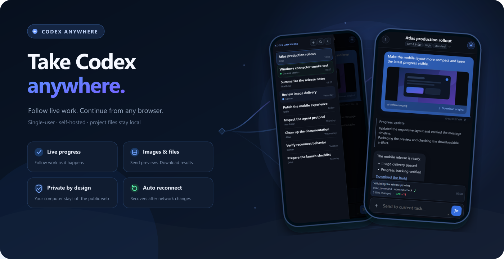
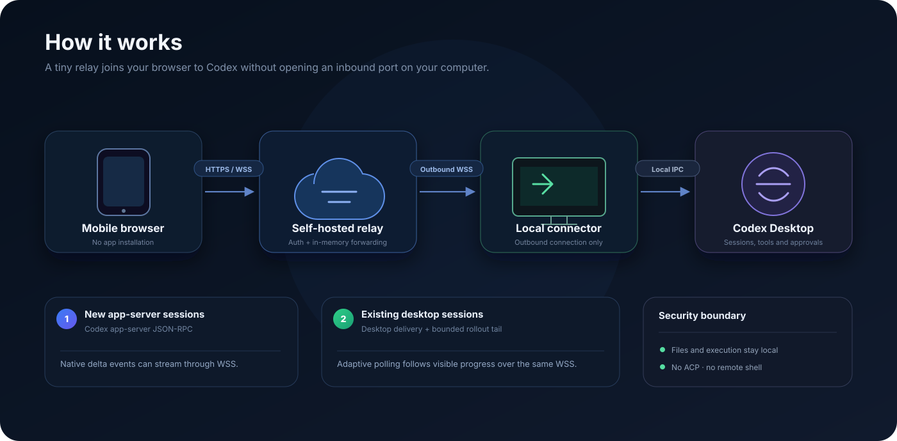
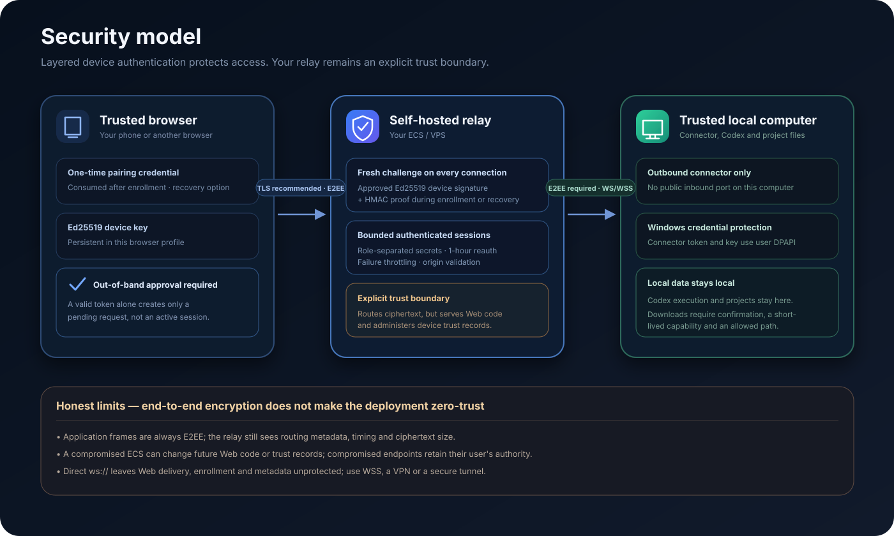

# Codex Anywhere

English | [简体中文](README.zh-CN.md)

[](https://github.com/gaotong132/codex-anywhere/actions/workflows/ci.yml)
[](https://github.com/gaotong132/codex-anywhere/actions/workflows/codeql.yml)
[](https://github.com/gaotong132/codex-anywhere/releases/latest)
[](LICENSE)

<p align="center">
  
</p>

Codex Anywhere is a single-user, self-hosted Web bridge for the Codex sessions on your computer. Follow
work from a phone, continue a task, send images, and bring generated files back without exposing your
computer to the public internet. Codex and project files remain on the connector computer; a small relay
you control provides the remote meeting point.

> [!IMPORTANT]
> This is an unofficial community project. It is not affiliated with or endorsed by OpenAI.

## What it does

- **Continue real Codex sessions** — browse recent sessions, read Markdown history, send text or images,
  and start a task in an existing local project.
- **Follow work as it happens** — see running and unread-complete sessions, progress updates, plan steps,
  tool purpose, elapsed time, and file-change totals. Long histories load incrementally.
- **Guide an active task** — append text to a connector-owned run, or use Desktop delivery when the
  existing session supports it. Messages are sent directly; Codex Anywhere does not maintain a Web queue.
- **Choose how Codex works** — view or change the model, reasoning effort, and fast mode when the selected
  Codex model exposes those options.
- **Use the results on mobile** — preview sent or generated images, open isolated Codex visualizations,
  copy messages, and download linked local files after confirmation.
- **Handle supported approvals** — approve or reject requests owned by a run started through the
  connector. Requests already owned by Codex Desktop remain on the computer.
- **Recover from network changes** — browser, relay, and connector reconnect and resynchronize without
  duplicating accepted messages.
- **Approve every endpoint** — browsers use a ten-minute, single-use pairing link and persistent device
  keys; connectors require both a secret and explicit owner approval.

Codex Anywhere deliberately stays small: it is not a multi-user gateway, a general remote shell, an
automatic session forker, or hosted conversation storage.

## Architecture

<p align="center">
  
</p>

```text
phone / browser ── WS or WSS ──> your ECS/VPS relay
                                      ▲
local connector ── outbound WS/WSS ───┘
       │
       └── Codex app-server / Desktop + local projects
```

Both endpoints connect outward to the relay. Application requests, responses, events, previews, and file
chunks travel through an authenticated end-to-end encrypted channel; the relay authenticates devices and
routes ciphertext without keeping a conversation database.

The connector starts its own Codex app-server for sessions it can own. Those runs support native events,
steering, stopping, and Web approvals. Existing Desktop sessions use Desktop delivery plus bounded,
adaptive history polling; an approval already owned by Desktop cannot be transferred. Codex Anywhere does
not implement ACP.

## Security at a glance

<p align="center">
  
</p>

| Boundary | Current protection |
| --- | --- |
| Browser access | Single-use pairing followed by an approved Ed25519 device identity; no shared browser login token |
| Application traffic | Authenticated X25519 exchange and XChaCha20-Poly1305 encryption between browser and connector |
| Local computer | Outbound connection only; Windows connector credentials use current-user DPAPI |
| Files | Root-bound previews, explicit download confirmation, short-lived capabilities, and sandboxed visualizations |
| Relay | Loopback-bound reference service, reduced container privileges, bounded logs, and device trust records only |

The relay is still trusted infrastructure: it serves Web code, manages device trust, and can observe routing
metadata, timing, and ciphertext size. A compromised relay, browser profile, or connector computer is not
made harmless by end-to-end encryption. Direct `ws://` keeps application frames encrypted but does not
protect Web delivery, pairing, or metadata. Prefer WSS, a VPN, or a secure tunnel on untrusted networks.

Read the honest threat model and incident steps in the [security policy](docs/SECURITY.md).

## Deploy

You need:

- a reachable Linux ECS/VPS with Git, Docker Engine, and Docker Compose v2;
- a Windows computer with Codex Desktop/CLI, Node.js 22+, Git, and PowerShell;
- a browser-reachable entry point. A domain, certificate, and reverse proxy are optional; WSS is
  recommended over public or untrusted networks.

Start the relay:

```bash
git clone https://github.com/gaotong132/codex-anywhere.git
cd codex-anywhere
./scripts/relay.sh setup
```

Install the Windows connector, approve it with `./scripts/relay.sh approve`, and create a browser pairing
link with `./scripts/relay.sh pair <public-url>`. The [deployment guide](docs/deployment.md) contains the
complete four-step flow and maintenance commands.

The reference service binds to `127.0.0.1:3300`; do not expose that port directly to the public internet.
The address is useful only for same-computer development unless an ingress, VPN, or tunnel provides the
remote entry point.

## Develop

Requirements: Node.js 22+ and an authenticated Codex CLI.

```bash
npm ci
npm run check
npm run build
```

Application source and tests use strict TypeScript. The generated JavaScript in `build/` and bundled Web
assets in `dist/` are build output and are not committed. See [Contributing](docs/CONTRIBUTING.md) for the
repository map and protocol rules.

## Community

Share setups and ideas in [GitHub Discussions](https://github.com/gaotong132/codex-anywhere/discussions),
or report reproducible problems through [Issues](https://github.com/gaotong132/codex-anywhere/issues).
Please report security concerns privately through the [security policy](docs/SECURITY.md).

## License

[MIT](LICENSE)
