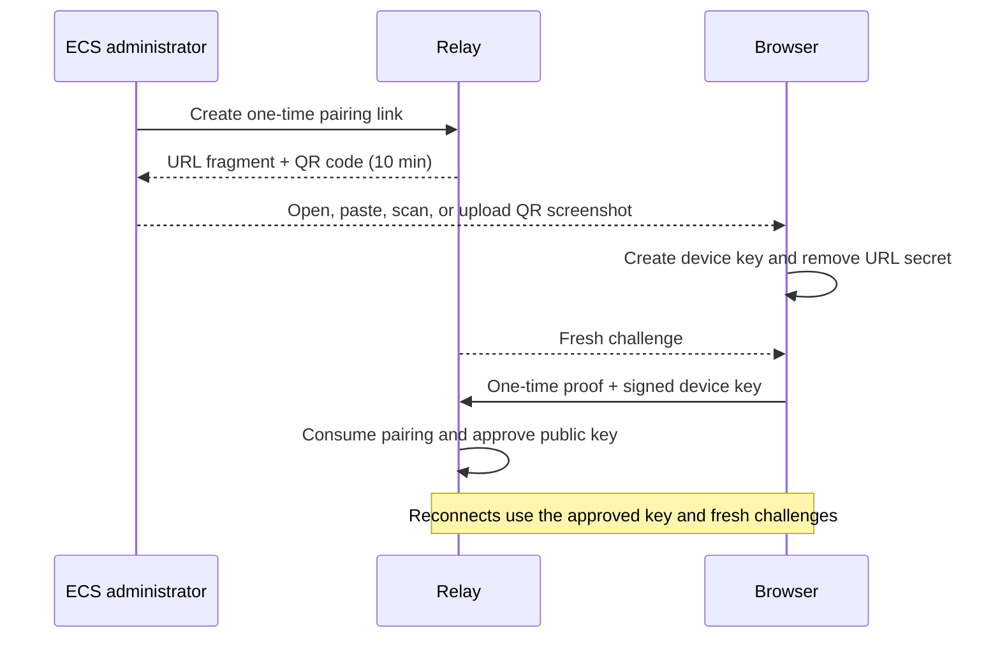

# Security Policy

English | [简体中文](SECURITY.zh-CN.md)

## Supported use

Only the latest commit on `main` is supported. Codex Anywhere is a single-user tool, not a
multi-tenant service.

## Report a vulnerability

Use [GitHub private vulnerability reporting](https://github.com/gaotong132/codex-anywhere/security/advisories/new).
Never put tokens, private addresses, conversation content, or local paths in a public issue.

## Current security model

- Codex, project files, attachments, and generated files stay on the connector computer. It accepts
  no public inbound connection.
- The relay has no conversation database and does not intentionally persist messages, previews, HTML,
  or download chunks.
- Browsers enroll only through a ten-minute, single-use pairing link and then authenticate with their
  approved Ed25519 device key. There is no shared browser Token or recovery login.
- Connectors require both their secret and an administrator-approved Ed25519 device key.
- Browser and connector authenticate ephemeral X25519 keys and encrypt application frames with
  XChaCha20-Poly1305. The relay sees routing metadata, timing, and approximate ciphertext size, but not
  message or file content.
- Authentication proofs are challenge-bound, authenticated sockets expire after one hour by default,
  repeated failures are throttled, and browser origins and frame sizes are checked.
- Windows protects the connector Token and device key with current-user DPAPI. Browser keys remain in
  that browser profile.

The pairing secret stays in the URL fragment, is removed before connecting, and is stored by the relay
only as a one-way verifier until it expires or is consumed.



Image previews are limited to configured roots, validated by content, resized, and converted to WebP.
Original downloads require confirmation and a short-lived capability bound to one client and file.
Interactive HTML is restricted to Codex visualizations and runs in a network-blocked, opaque-origin
sandbox in the browser.

## Trust boundary

The ECS/VPS remains trusted infrastructure because it serves the Web app and manages device approvals.
A compromised host administrator can replace Web code or trust records, approve an attacker-controlled
device, observe metadata, or deny service. A compromised browser profile or connector computer keeps
that endpoint's authority. End-to-end encryption reduces relay exposure; it does not make the system
zero-trust.

Direct `ws://` is supported and application frames remain end-to-end encrypted, but HTTP/WS does not
protect Web delivery, pairing, metadata, or availability from the network. Prefer WSS, a VPN, or a
secure tunnel on untrusted networks.

## Deployment baseline

- Generate the connector Token from at least 32 random bytes and store the relay copy in a root-readable
  `.env`. Never give it to a browser.
- Keep the device registry volume private, persistent, and backed up only with encryption. Revoke lost
  or retired devices.
- Expose the relay through a maintained ingress or private network. The reference Compose service binds
  port 3300 to ECS loopback only.
- Use SSH keys, patch the host, restrict firewall rules, and disable proxy access logs or keep them briefly.
- Set `BRIDGE_TRUST_PROXY=1` only when the trusted proxy is the relay's only ingress and overwrites
  `X-Real-IP`.
- Keep `CODEX_ALLOWED_ROOTS` narrow. Enable unrestricted downloads or connector network access only when
  explicitly needed.
- Rotate any secret that appears in chat, logs, screenshots, commits, CI output, or shell history.

## Device administration

Device approval and revocation are available only from the relay host:

```bash
./scripts/relay.sh pair https://codex.example.com
./scripts/relay.sh devices
./scripts/relay.sh revoke
```

The running relay applies revocation and closes the device connection, normally within 30 seconds.

## If a credential may have leaked

1. Revoke the affected device. Treat a leaked device private key as a compromised device.
2. Replace a leaked `BRIDGE_CONNECTOR_TOKEN`, reinstall the connector credential, and restart both sides.
3. Review ECS and proxy logs, browser extensions, clipboard and shell history, CI output, and related
   infrastructure credentials.

## Out of scope

Codex Anywhere does not defend against a compromised connector computer, ECS root account, approved
browser profile, or a harmful Codex action the user approves. It is not a general remote shell,
multi-tenant identity provider, or zero-trust gateway.
