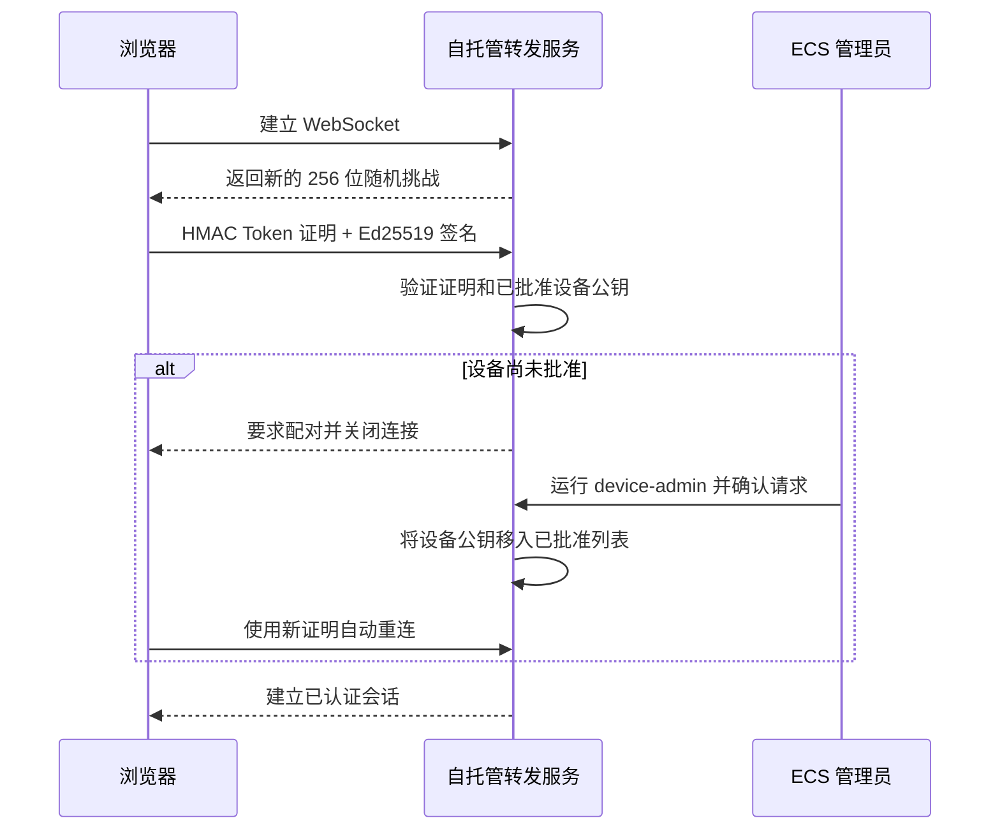

# 正式部署

[English](deployment.md) | 简体中文

Codex Anywhere 使用一台小型公网 ECS/VPS 作为会合转发节点。转发服务不是 Codex 本身：Codex
Desktop/CLI、项目文件、附件和生成文件都保留在连接器电脑上。`http://127.0.0.1:3300` 只用于
同机开发测试，对手机远程访问没有实际意义。

## 核心资源与部署选项

| 资源 | 要求 | 单用户建议基线 |
| --- | --- | --- |
| 可访问的 ECS/VPS | 必需 | Linux、1 核 CPU、1 GB 内存、10–20 GB 磁盘 |
| 本地电脑 | 必需 | Codex Desktop/CLI、Node.js 22+、可访问外网 |
| 加密传输 | 跨不可信或公网时强烈建议 | TLS、VPN 或安全隧道；运维人员仍可自行承担风险选择明文 `ws://` |
| 域名与 DNS | 可选 | 便于提供稳定的公网 TLS 入口 |
| HTTPS 证书 | 可选组件 | 选择 HTTPS/WSS 入口时使用 |
| Docker、Compose、Nginx、证书工具 | 可替换的参考栈 | 可换成等价的服务与加密入口组件 |

不需要数据库、Redis、对象存储、本地电脑公网 IP、路由器端口映射或本地入站防火墙规则。

```text
手机/浏览器 ── HTTPS/WSS ──> ECS Nginx :443 ──> 转发服务 127.0.0.1:3300
                                         ▲
本地连接器 ────── 出站 WSS ───────────────┘
       │
       └── Codex Desktop/CLI 与项目文件
```

## 隐私与信任边界

ECS 可以降低个人电脑暴露面：两端都主动建立出站连接，ECS 不保存会话数据库，参考部署也不会公开
3300 端口。转发服务只在内存中传递消息、图片预览和下载分块，并且不会有意持久化这些内容。建议这些
连接使用 WSS。

这并不是穿透不可信转发节点的端到端加密。推荐的 WSS 部署会在 ECS 入口终止 TLS，转发进程仍能在
内存中看到明文帧；使用 WS 时，网络路径也能看到内容。因此 ECS root 管理员、云厂商、代理服务商，
以及同时掌握已批准设备和对应角色 Token 的人员都属于信任边界。应使用自己控制的基础设施、减少管理
人员和日志、及时打补丁、分离两个角色，并在疑似泄露后撤销设备或轮换 Token。

## 1. 网络与主机准备

1. 使用域名时，将 DNS 记录指向 ECS EIP。
2. 只开放加密入口所需端口。参考 HTTPS 部署使用 TCP 443；TCP 80 仅在跳转或证书校验时需要。
3. 将 SSH 限制到可信来源或 VPN，并优先使用 SSH 密钥而不是密码。
4. 参考反向代理部署中，云安全组和主机防火墙都不要开放 TCP 3300。如果有意直接使用 `ws://`，
   只开放选定的转发端口，尽可能限制来源范围，并接受消息会以明文传输。
5. 使用仓库提供的参考方案时，安装持续维护的 Docker Engine、Docker Compose v2、Nginx，以及
   适合当前环境的证书工具；也可以使用等价组件。

条件允许时使用专用、最小权限服务器。不要在 ECS 安装 Codex，也不要把本地项目复制到 ECS。

## 2. 转发服务与密钥

在 ECS 克隆仓库，并在仅 root 可读的 `.env` 中创建相互独立的浏览器 Token 和连接器 Token。
每个 Token 至少使用 32 字节密码学安全随机数据（64 个十六进制字符）。以下命令不会把 Token 写进
Shell 历史：

```bash
git clone https://github.com/gaotong132/codex-anywhere.git
cd codex-anywhere
umask 077
BRIDGE_CLIENT_TOKEN_INPUT="$(openssl rand -hex 32)"
BRIDGE_CONNECTOR_TOKEN_INPUT="$(openssl rand -hex 32)"
printf 'BRIDGE_CLIENT_TOKEN=%s\n' "$BRIDGE_CLIENT_TOKEN_INPUT" > .env
printf 'BRIDGE_CONNECTOR_TOKEN=%s\n' "$BRIDGE_CONNECTOR_TOKEN_INPUT" >> .env
printf 'CODEX_UI_LANGUAGE=zh-CN\n' >> .env
unset BRIDGE_CLIENT_TOKEN_INPUT BRIDGE_CONNECTOR_TOKEN_INPUT
chmod 600 .env
docker compose up --build -d
```

只通过加密的管理员会话读取浏览器 Token，并将其保存到密码管理器。本地安装器只接收连接器 Token。
不要把任何 Token 粘贴到聊天、Issue、截图、源码、Shell 参数或 CI 日志。除非备份已加密并严格控制
访问，否则不要把 `.env` 纳入服务器备份。

转发服务同时要求新的 HMAC Token 证明和已批准设备密钥的 Ed25519 签名；它会拒绝证明重放、临时
锁定重复失败，并每小时更新认证连接（`BRIDGE_SESSION_MAX_AGE_MS`）。Compose 卷
`bridge-state` 在 `/data/devices.json` 只持久化设备公钥和配对元数据；设备私钥不会进入转发服务。

Compose 服务默认：

- 只把 ECS 的 `127.0.0.1:3300` 发布到容器；
- 使用非特权用户和只读文件系统；
- 删除全部 Linux capabilities；
- 限制进程数，使用小型临时文件系统，轮转容器日志，并提供健康检查。

配置公网代理前先验证监听地址：

```bash
docker compose ps
curl -fsS http://127.0.0.1:3300/health
ss -ltn | grep 3300
```

`ss` 显示的地址必须是 `127.0.0.1:3300`，不能是 `0.0.0.0:3300` 或 `[::]:3300`。

## 3. 可选参考方案：TLS 反向代理

使用仓库提供的 Nginx 方案时，先获取适合该入口的证书，再把
[`deploy/nginx-example.conf`](../deploy/nginx-example.conf) 复制到 Nginx 站点配置。将所有
`codex.example.com` 替换为实际主机名，并按需调整证书路径。

示例 Nginx 策略默认关闭访问日志，避免保留客户端 IP 和请求元数据；只保留警告和错误诊断，覆盖可信
`X-Real-IP`，并且只把 WebSocket 转发到 ECS 回环地址。排障时如需访问日志，应临时开启、缩短保留期，
排障结束后立即关闭。

```bash
sudo nginx -t
sudo systemctl reload nginx
curl -fsS https://codex.example.com/health
```

除非愿意把第三方纳入信任边界，否则不要在前方增加会终止 TLS 或保存元数据的 CDN/托管反向代理。

## 4. 本地连接器

本地电脑必须已有完成认证的 Codex CLI/Desktop 环境。连接器同时支持 `ws://` 和 `wss://`；路径经过
公网或其他不可信网络时强烈建议使用 WSS。

前台测试：

```powershell
$env:BRIDGE_CONNECTOR_TOKEN = Read-Host 'Connector token'
$env:BRIDGE_URL = 'wss://codex.example.com/ws'
$env:CODEX_NETWORK_ACCESS = '0'
npm run connector
```

Windows 登录启动安装器使用当前用户 DPAPI 保存 Token，而不是写入仓库或明文脚本。它还会建立独立、
持久的 Ed25519 连接器身份，并使用同一 DPAPI 边界保护私钥：

```powershell
$connectorToken = Read-Host 'Connector token' -AsSecureString
$clientToken = Read-Host 'Browser client token' -AsSecureString
.\scripts\install-connector.ps1 `
  -ConnectorToken $connectorToken `
  -ClientToken $clientToken `
  -BridgeUrl 'wss://codex.example.com/ws'
```

安装后的登录启动项会在当前交互用户会话中运行轻量守护进程。应用升级或连接器意外退出时，它会重新
启动唯一的 Node 连接器进程。守护进程不解密也不长期持有 Token；每次重启都通过 DPAPI 启动器。

新会话必须在 Web UI 明确选择项目目录，不存在默认工作区配置。`-AllowedRoots` 可选，默认只包含
连接器仓库；只有需要选择更多本地目录时才配置。下载默认限制在这些根目录内。只有在单用户可信电脑上
明确需要不受限本地下载时才添加 `-AllowAnyFileDownload`。除非任务确实需要，否则保持网络访问关闭。

加密凭据和非敏感配置保存在仓库外的 `%LOCALAPPDATA%\PersonalCodexBridge`。再次运行安装器时可以
省略两个 Token，只更新设置并保留凭据。`scripts/copy-token.ps1` 只复制单独保存的浏览器 Token，
不会暴露连接器 Token。在共享电脑上使用后应清除剪贴板历史。

## 5. 批准首个可信浏览器

转发服务不会自动批准设备。打开 Web 页面，输入浏览器 Token，并让页面停留在通用的“等待批准”状态。
随后在 ECS 部署目录的加密管理员会话中运行一条命令：



```bash
docker compose exec bridge node build/server/device-admin.js
```

- 原始 Token 和设备私钥不会发送到转发服务。有效 Token 配合未批准密钥只能创建一条待批准请求，
  请求约 15 分钟后过期。
- Web UI 不能查看或批准设备。命令只显示角色、标签、来源地址和请求时间；输入匹配序号并确认，无法
  明确识别时不要批准。
- 批准结果直接写入共享设备注册表，无需重启转发服务；浏览器会自动重连并使用新挑战重新认证。

这里批准的只是浏览器设备身份，与 Codex 的命令执行、文件修改和权限审批是不同的控制。

## 6. 端到端验证

1. 打开 `https://codex.example.com`，输入 `BRIDGE_CLIENT_TOKEN`，确认已批准的连接器在线。
2. 打开一个已有会话并发送无害测试消息。
3. 确认 Codex Desktop 和浏览器都能看到消息与回复。
4. 确认 HTTP 会跳转到 HTTPS，并且外网无法访问 `http://ECS-IP:3300`。
5. 检查 `docker compose ps`，转发服务应在启动期后变为 `healthy`。

## 更新

浏览器分页和连接器操作会同步演进，因此 ECS 转发服务和本地连接器应保持相同提交：

```bash
git pull --ff-only
docker compose up --build -d
curl -fsS http://127.0.0.1:3300/health
```

连接器代码变化后也要重启本地连接器。拉取前先阅读发布说明，不要授予 ECS 访问本地项目目录的权限。
